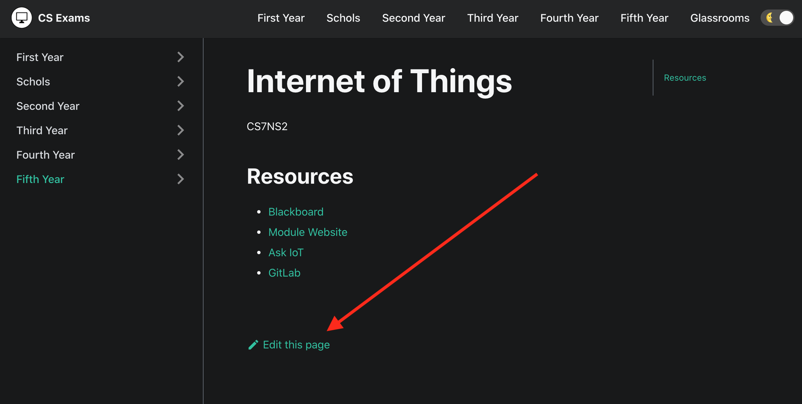
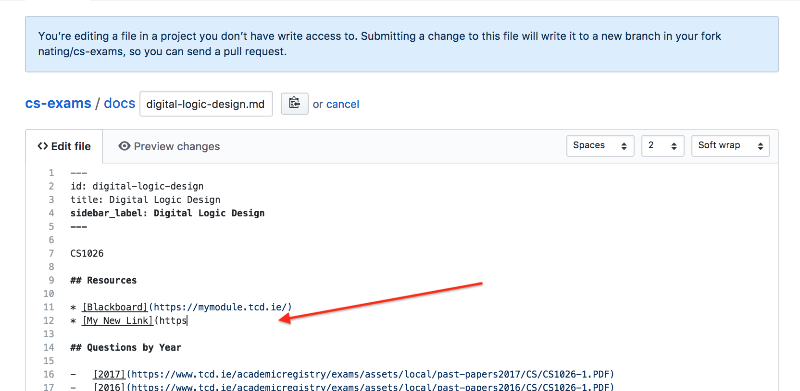
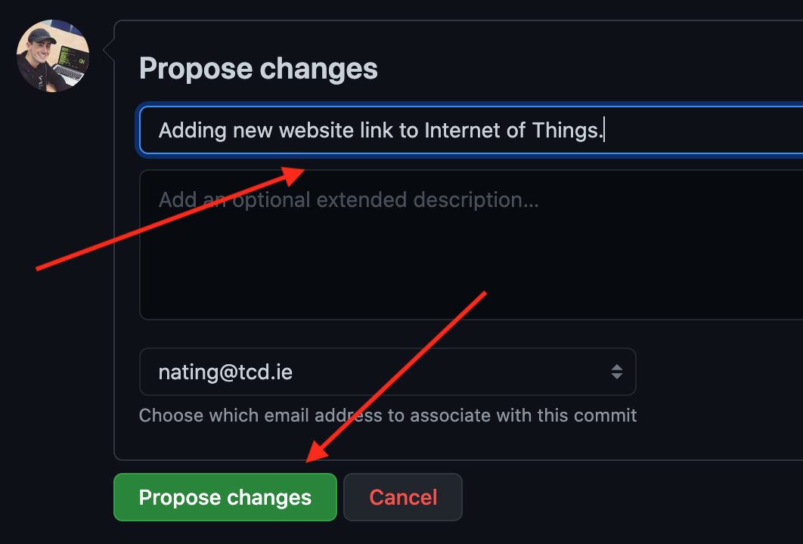
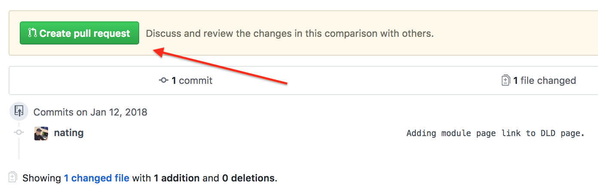
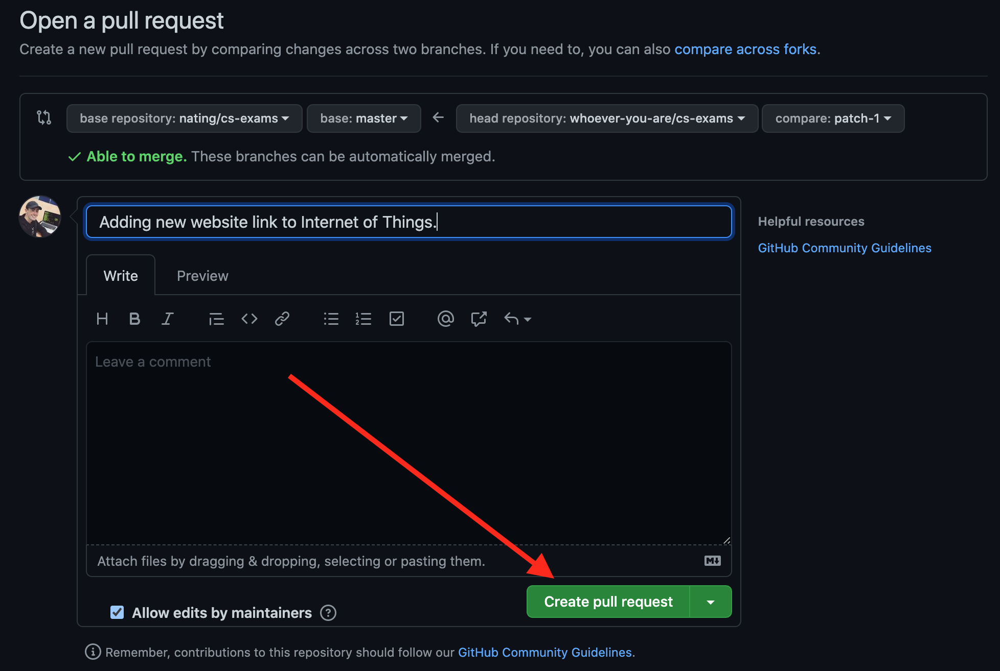

# cs-exams
 

  

	

<a href="http://makeapullrequest.com"><a/>

  <a href="https://cs-exams.com">cs-exams.com<a/>

## Overview

cs-exams.com is a website to make accessing resources for study less convoluted for Computer Science students in Trinity.

It is put together by students and maintained by students so that it can be as beneficial for them as possible.

## Contributing

Contributing is highly encouraged! It is great to help other students out!

The easiest way to contribute is to: 
1. Click the `EDIT` button in the top right hand corner of a module's page: 
2. Make the changes and make sure that the changes work: 
3. Write an appropriate commit title that captures the change, and hit `Propose file change`: 
4. Review your changes and hit `Create pull request`:  
	1. 
	2.  
5. Wait a few hours for your pull request to be merged and published!

Thanks for helping out 😁
