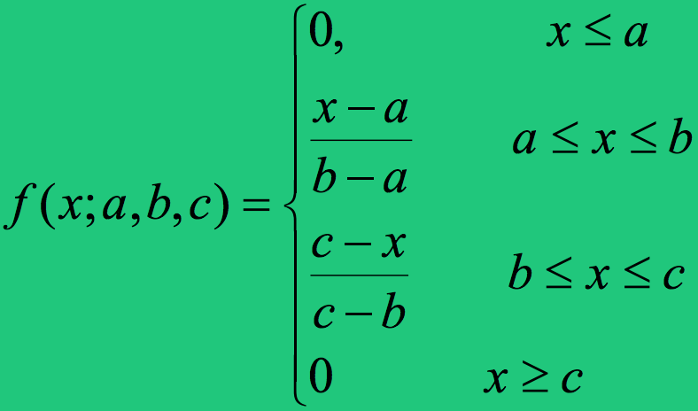
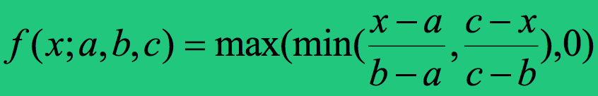

## Properties of Fuzzy Sets and Relationships amongst the sets

**Crips Sets** are sets governed by the rules of classical set theory.

A Fuzzy Set's **Membership Function** (or 'Characteristic Function') is the function that assigns each element a grade of membership to the set ranging between zero and one.

A Fuzzy Set is said to be **characterised** by its membership function.

**Fuzzy Conditional Statements** are expressions of the form IF A THEN B, where A and B have fuzzy meaning, e.g.: IF x is small THEN y is large, where small and large are viewed as labels of fuzzy sets.

A **Fuzzy Algorithm** is an ordered sequence of instructions which may contain fuzzy assignment and conditional statements.

A **Fuzzy Restriction** is: <TODO: Enter definition of a Fuzzy Restriction here>.

A fuzzy set *A* of elements (the denominators in this representation [which happen to be numbers in this example]) that have degrees of membership (the numerators in this representation) of *A*, is usually be represented like this:
```
A =0/1+0/2+0/3+0/4+0/5+ 0.2/6 + 0.5/7 + 0.8/8 + 1/9 + 1/10
```

The numerators in the above representation of a fuzzy set are referred to as **grades of membership**.

The membership grade of an element *x* in a fuzzy set *A* is written 𝝻<sub>*A*</sub>(*x*) or A(*x*).

---

### Properties of Fuzzy Sets:

|Property|Definition|Explanation
|---|---|---
|1) Equality of two fuzzy sets|A fuzzy set *A* is considered equal to a fuzzy set *B*, if and only if: <code>𝝻<sub>*A*</sub>(*x*) = 𝝻<sub>*B*</sub>(*x*)</code>.  |Sets are equal only when their  membership functions are equal.
|2) Inclusion of one fuzzy set into another fuzzy set|Let *X* and *Y* be fuzzy sets defined in the same universal space *U*. *X* is a subset of *Y* if and only if: <code>For every *u* in the set *U* we have *X*(*u*) ≤ *Y*(*u*)</code>.|If every element is always more in Y than X then X is a subset of Y.
|3) Cardinality of a fuzzy set|The **Cardinality** (or 'Sigma Count') of a fuzzy set *A* is given: <code>CARD<sub>*A*</sub>=𝝻<sub>*A*</sub>(*x*<sub>1</sub>)+𝝻<sub>*A*</sub>(*x*<sub>2</sub>)+...+𝝻<sub>*A*</sub>(*x*<sub>n</sub>)</code>.|The cardinality of a fuzzy set is the sum the membership grades of all its elements.
|4) An empty fuzzy set|A fuzzy set *A* is empty if and only if <code>𝝻<sub>*A*</sub>(*x*)=0</code> for all *x* ∊ *X*.|A fuzzy set is empty if the membership grade of every element in the set is zero.
|5) Alpha-cuts|An **Alpha-cut** (or 'A-level set') of a fuzzy set *A*⊂*X* is an ordinary set *A*<sub>𝜶</sub>⊂*X* such that <code>*A*<sub>𝜶</sub>={*x*∊*X*;𝝻<sub>*A*</sub>(*x*)≥𝜶}</code>.|The 'Alpha level cut' of a fuzzy set is the crisp set of elements in the set with membership grades above a value '𝜶'.

A **Normal** fuzzy set *A* is a fuzzy set where there exists at least one element *x*∊*A* such that 𝝻<sub>*A*</sub>(*x*)=1.

A **Subnormal** fuzzy set is a fuzzy set that is not normal.

The **Height** of a fuzzy subset *A* is the largest membership grade of an element in *A*.

The **Support** of a fuzzy set *A*⊆*X* is the crisp subset of *X* whose elements all have non-zero membership grades in *A*.

The **Core** of a fuzzy set *A*⊆*X* is the crisp subset of *X* whose elements all have membership grades of 1 in *A*.

The **Universe of Discourse** is the range of all possible values for an input to a fuzzy system.

The **Crossover Point** of a fuzzy set is the element at which its membership function is 0.5.

A **Fuzzy Singleton** is a fuzzy set whose support is a single point in U with a membership function of one.

---

### Fuzzy Set Operations

1. The **Complement**, *cA*, of a fuzzy set *A* is: 𝝻<sub>*cA*</sub>(*x*)=1-𝝻<sub>*A*</sub>(*x*).

2. The **Union** of fuzzy subsets, A and B, of the set X is the set C, where 𝝻<sub>*C*</sub>(*x*<sub>i</sub>)=MAX(𝝻<sub>*A*</sub>(*x*),𝝻<sub>*B*</sub>(*x*)) for all *x*∊*X*.

3. The **Intersection** of fuzzy subsets, A and B, of the set X is the set C, where 𝝻<sub>*C*</sub>(*x*<sub>i</sub>)=MIN(𝝻<sub>*A*</sub>(*x*),𝝻<sub>*B*</sub>(*x*)) for all *x*∊*X*.

4. **Concentration** is an operation that reduces volume. In terms of fuzzy set theory, performing concentration on a fuzzy set *A*⊆*X* can involve creating a fuzzy set *B*⊆*A* where 𝝻<sub>*B*</sub>(*x*) = (𝝻<sub>*A*</sub>(*x*))<sup>𝜶</sup>, given that 𝜶≥1.

5. **Dilation** is an operation that makes things wider. In terms of fuzzy set theory, performing dilation on a fuzzy set *A*⊆*X* can involve creating a fuzzy set *B*⊇*A* where 𝝻<sub>*B*</sub>(*x*) = (𝝻<sub>*A*</sub>(*x*))<sup>𝜶</sup>, given that 𝜶≤1.

6. The **Level Set** operation involves: If we have a set *A*⊆*X*, we can define a new set *F* such that 𝝻<sub>*F*</sub>(*x*)=𝜶(𝝻<sub>*A*</sub>(*x*)) for all *x*∊*X*, given 0≤𝜶≤1.

Things might be easier to comprehend having read that Concentration and Dilation are the same operation, **Exponentiation**, except that 𝜶 is greater than or less than 1.

*The Concentration and Dilation may seem mixed up, but a membership function less than one, to the power of alpha which is less than one, causes the membership function to **increase**. ie: `(0.5)^(0.5)==(~0.7)`*

In most cases, the intersection of a fuzzy subset and its complement is not the null set.

Non-primary terms can be computed like this:  

* <code>𝝻<sub>*very young*</sub> = (𝝻<sub>*young*</sub>)<sup>2</sup></code>
* <code>𝝻<sub>*more or less young*</sub> = (𝝻<sub>*young*</sub>)<sup>1/2</sup></code>
* <code>𝝻<sub>*not very young*</sub> = 1 - (𝝻<sub>*young*</sub>)<sup>2</sup></code>

Membership functions can have different shapes. It is very important to know these for the exam:    


In the above image, an example of a symmetric triangular membership function was shown. Not all triangular membership functions are symmetric, and the generic way to calculate triangular membership functions is:  


The triangular membership function is also sometimes represented as:  


The **Cross Product** (or *Cartesian Product*) of *A*⊆*X* and *B*⊆*Y* is denoted as *T*=*A*x*B*, and is given: 𝝻<sub>*T*</sub>(*x*,*y*)=MIN[𝝻<sub>*A*</sub>(*x*),𝝻<sub>*B*</sub>(*y*)].

Cross products facilitate the mapping of fuzzy subsets that belong to disparate quantities or observations.

A **Fuzzy Patch** is defined by a fuzzy rule: a patch is a mapping of two membership functions (e.g: 'IF WARM THEN FAST').

A rule in a fuzzy controller's ruleset generates the product of the input & output fuzzy sets.

**Primary Membership Terms**, are those such as *fat*, *weird* & *nice* (𝝻<sub>*fat*</sub>,𝝻<sub>*weird*</sub> & 𝝻<sub>*nice*</sub>), whereas terms such as *very fat*, *more or less weird* & *not nice* ((𝝻<sub>*fat*</sub>)<sup>2</sup>,(𝝻<sub>*weird*</sub>))<sup>1/2</sup> & (1-𝝻<sub>*nice*</sub>)) are **Non-Primary Membership Functions** as they can be made up from other terms.

The **Base Variable** of a fuzzy set e.g. *Young*, is the parameter type that the membership function is applied to e.g. *Age*.
