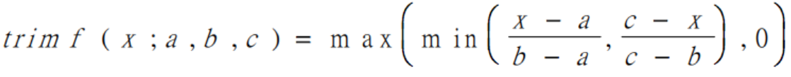
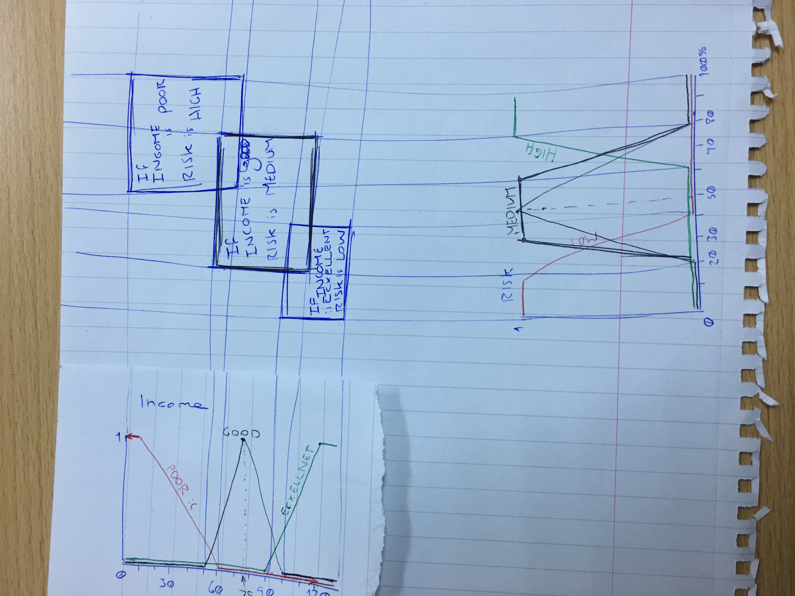
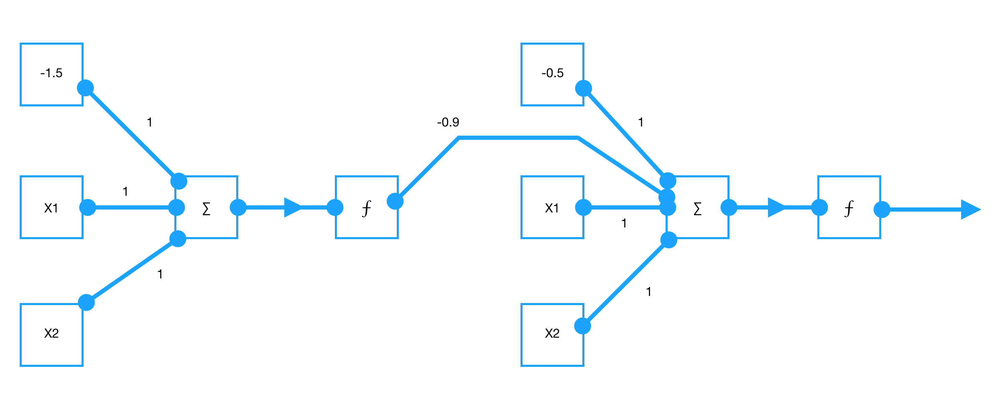

*This document contains an attempt at answering the questions from the 2011 CS4001 Fuzzy Logic exam*

# 2011

## 2011 Q1

### 1a)

To compute the membership functions, I will be using the exponential of half the difference between the ancestor and the daughter species, as suggested:  

||Parent/Daughter|Grandparent/Daughter|Great Grandparent/Daughter|Great Great-Grandparent/Daughter|
|-------------|---|---|---|---|
|Distance     |  1|  2|  3|  4|
|Belongingness|exp(-0.5)=0.61|exp(-1)=0.367|exp(-1.5)=0.223|exp(-2)=0.135|

`Great Great-Grandparent =  {0.135/Pacific Lamprey, 0.135/Arctic Lamprey, 0.135/Atlantic Salmon, 0.135/Pacific Salmon, 0.135/Blue Shark, 0.135/White Shark, 0.135/Non-snake Lizard, 0.135/Snake-like Lizards}`

**Note for student readers: [The model answer](https://www.scss.tcd.ie/Khurshid.Ahmad/Teaching/Lectures_on_Fuzzy_Logic/Model_Answers.pdf#page=2) has neglected to include terms from the universe with membership grades of zero in the following fuzzy sub-sets. I have included every term in each of my fuzzy sub-sets. (I'm not sure the model answer is right here)**

`Great Grandparent =  {0/Pacific Lamprey, 0/Arctic Lamprey, 0.223/Atlantic Salmon, 0.223/Pacific Salmon, 0.223/Blue Shark, 0.223/White Shark, 0.223/Non-snake Lizard, 0.223/Snake-like Lizards}`

`Grandparent =  {0/Pacific Lamprey, 0/Arctic Lamprey, 0.367/Atlantic Salmon, 0.367/Pacific Salmon, 0/Blue Shark, 0/White Shark, 0.367/Non-snake Lizard, 0.367/Snake-like Lizards}`

`Salmon-Parent =  {0/Pacific Lamprey, 0/Arctic Lamprey, 0.61/Atlantic Salmon, 0.61/Pacific Salmon, 0/Blue Shark, 0/White Shark, 0/Non-snake Lizard, 0/Snake-like Lizards}`

`Lizard-parent =  {0/Pacific Lamprey, 0/Arctic Lamprey, 0/Atlantic Salmon, 0/Pacific Salmon, 0/Blue Shark, 0/White Shark, 0.61/Non-snake Lizard, 0.61/Snake-like Lizards}`

## 2011 Q2

### 2a)

**2ai)**    
Crisp Statement: If A THEN B;  
Fuzzy Statement: If A(𝝁<sub>A</sub>) THEN B(𝝁<sub>B</sub>)  

**2aii)**  
Crisp Statement: A is_a_part_of B  
Fuzzy Statement: For all x of X, 𝝁<sub>A</sub>(x) ≤ 𝝁<sub>B</sub>(x)   

**2aiii)**  
**Note to student readers: I am unable to come up with how the following crisp relation could be translated into fuzzy logic in any sort of way. The difficult to decipher model answer can be found [here](https://www.scss.tcd.ie/Khurshid.Ahmad/Teaching/Lectures_on_Fuzzy_Logic/Model_Answers.pdf#page=4).**  
Crisp Relation:  
```
A:= 5
If A < 5 then B:=A+5.
```  
Fuzzy Relation:  
```
TODO: ?
```

**2aiv)**  
Crisp Statement: A weighs 5 kilo-grammes;  
Fuzzy Statement: A weighs about 5 kilo-grammes  

**2av)**  
**Note to student readers: I have not been able to verify this answer.**  
Crisp Relation: Ā or not (A) to donote that A is false  
Fuzzy Relation: 1-A to denote the fuzzy set Ā where 𝝁<sub>Ā</sub>(x) is 1-𝝁<sub>A</sub>(x).

**2avi)**  
Crisp Relation: A belongs_to class B, so Ā does not belong_to B
Fuzzy Relation:  
In a fuzzy relation, this relationship is not true. In fuzzy logic:  
𝝁<sub>A</sub>(x) ≤ 𝝁<sub>B</sub>(x) for all x of X ≠ (1-𝝁<sub>A</sub>(x)) ≤ 𝝁<sub>B</sub>(x)

### 2b)

To compute the membership function for GOOD INCOME, I have used the triangular membership function:  
  
*where a=20, b=40 & c=80*

To compute the membership function for MEDIUM RISK, I have used the trapezoidal membership function:  
  
*where a=20%, b=40%, c=60% & d=80%*

**Note for student readers: [The model answer](https://www.scss.tcd.ie/Khurshid.Ahmad/Teaching/Lectures_on_Fuzzy_Logic/Model_Answers.pdf#page=7) is a quickly put together fuzzy patch diagram with lines in the wrong places (not matching up with any point of interest on the graphs in certain places). I do not think that it makes sense to create rules from membership functions like this question asks to. For instance, no part of the question says that POOR INCOME has anything more to do with HIGH RISK than EXCELLENT INCOME. Therefore if a student is to create a fuzzy patch for these membership function, they would be just as right to create one for HIGH RISK and EXCELLENT INCOME. Fuzzy patches are a way of visualising rules, and I am not aware of a way that they can be created without the rules the correspond to. However, below is my answer:**



## 2011 Q4

### 4a

Beginning of bend (X<sub>1</sub>): `9.95`  
Inner barrier (X<sub>2</sub>): `30`  
Direction X<sub>3</sub>: `0`

**Fuzzification:**  
<code>𝝁<sub>SMALL</sub>(X<sub>1</sub>) = 0.801</code>  
<code>𝝁<sub>MEDIUM</sub>(X<sub>1</sub>) = UNDEFINED</code>  
<code>𝝁<sub>LONGWAY</sub>(X<sub>1</sub>) = UNDEFINED</code>  

<code>𝝁<sub>MIN</sub>(X<sub>2</sub>) = 0.25</code>  
<code>𝝁<sub>MAX</sub>(X<sub>2</sub>) = 0.167</code>  

<code>𝝁<sub>OUTWARDS</sub>(X<sub>3</sub>) = UNDEFINED</code>  
<code>𝝁<sub>INWARD</sub>(X<sub>3</sub>) = UNDEFINED</code>  
<code>𝝁<sub>FORWARD</sub>(X<sub>3</sub>) = 1</code>  

**Inference:**  
The following rules fire to the following degrees:  
Rule 1: `min(0.801,0.25,1) = 0.25`  
Rule 3: `min(0.801,0.167,1) = 0.167`  

*I am making the assumption that Rule 4 is supposed to contain the term 'MEDIUM' rather than 'MODERATE'.*

**Composition:**  
<code>𝝶<sub>1</sub> = 0.25 - 0.02(9.95) + 0.06(30) - 0.05(0) = 1.851</code>  
<code>𝝶<sub>3</sub> = 3 - 0.02(9.95) + 0.02(0) = 2.801</code>  

`Output = (0.25*1.851 + 0.167*2.801)/(0.25+0.167) = 2.231`

### 4b

Beginning of bend (X<sub>1</sub>): `65.1`  
Inner barrier (X<sub>2</sub>): `30`  
Direction X<sub>3</sub>: `-30`

**Fuzzification:**  
<code>𝝁<sub>SMALL</sub>(X<sub>1</sub>) = 0.83</code>  
<code>𝝁<sub>MEDIUM</sub>(X<sub>1</sub>) = UNDEFINED</code>  
<code>𝝁<sub>LONGWAY</sub>(X<sub>1</sub>) = UNDEFINED</code>  

<code>𝝁<sub>MIN</sub>(X<sub>2</sub>) = 0.25</code>  
<code>𝝁<sub>MAX</sub>(X<sub>2</sub>) = 0.167</code>  

<code>𝝁<sub>OUTWARDS</sub>(X<sub>3</sub>) = 0.25</code>  
<code>𝝁<sub>INWARD</sub>(X<sub>3</sub>) = UNDEFINED</code>  
<code>𝝁<sub>FORWARD</sub>(X<sub>3</sub>) = 0</code>  

**Inference:**  
The following rules fire to the following degrees:  
Rule 4: `min(0.83,0.25,0.25) = 0.25`  

*I am making the assumption that Rule 4 is supposed to contain the term 'MEDIUM' rather than 'MODERATE'.*

**Composition:**  
<code>𝝶<sub>4</sub> = 3 - 0.02(65.1) + 0.01(30) - 0.04(-30) = 3.198</code>  

`Output = (0.25*3.198)/(0.25) = 3.198`

## 2011 Q5

### 5a)

**Epoch 1**

 X1| X2|Desired output|  w1|  w2| Sum|Actual output|Error|  w1|  w2
---|---|--------------|----|----|----|-------------|-----|----|----
  0|  0|             0| 0.3|-0.1|-0.3|            0|    0| 0.3|-0.1
  1|  0|             1| 0.3|-0.1|   0|            0|    1| 0.5|-0.1
  0|  1|             1| 0.5|-0.1|-0.4|            0|    1| 0.5| 0.1
  1|  1|             1| 0.5| 0.1| 0.3|            1|    0| 0.5| 0.1

**Epoch 2**

 X1| X2|Desired output|  w1|  w2| Sum|Actual output|Error|  w1|  w2
---|---|--------------|----|----|----|-------------|-----|----|----
  0|  0|             0| 0.5| 0.1|-0.3|            0|    0| 0.5| 0.1
  1|  0|             1| 0.5| 0.1| 0.2|            1|    0| 0.5| 0.1
  0|  1|             1| 0.5| 0.1|-0.2|            0|    1| 0.5| 0.3
  1|  1|             1| 0.5| 0.3| 0.8|            1|    0| 0.5| 0.3

**Epoch 3**

 X1| X2|Desired output|  w1|  w2| Sum|Actual output|Error|  w1|  w2
---|---|--------------|----|----|----|-------------|-----|----|----
  0|  0|             0| 0.5| 0.3|-0.3|            0|    0| 0.5| 0.3
  1|  0|             1| 0.5| 0.3| 0.2|            1|    0| 0.5| 0.3
  0|  1|             1| 0.5| 0.3|   0|            0|    1| 0.5| 0.5
  1|  1|             1| 0.5| 0.5|   7|            1|    0| 0.5| 0.5

**Epoch 4**

 X1| X2|Desired output|  w1|  w2| Sum|Actual output|Error|  w1|  w2
---|---|--------------|----|----|----|-------------|-----|----|----
  0|  0|             0| 0.5| 0.5| 0.3|            0|    0| 0.5| 0.5
  1|  0|             1| 0.5| 0.5| 0.2|            1|    0| 0.5| 0.5
  0|  1|             1| 0.5| 0.5| 0.2|            1|    0| 0.5| 0.5
  1|  1|             1| 0.5| 0.5|   7|            1|    0| 0.5| 0.5

### 5b)

The XOR gate cannot be modelled by simple perceptron because it does not belong to the set of linearly separable problems.

A single perceptron can represent a line in an input space where all inputs below have one output value and all inputs above have another. However the input space of an XOR gate can not be divided by a line to get all of the inputs related to zero on one side and all of the inputs related to one on the other.

Because of this; the XOR gate can not be modelled by a single perceptron.

### 5c)

In order to model XOR gate we need to design a neuro-fuzzy system with one hidden layer. In this system, first layer would comprise inputs x1 and x2 and a bias. Two input nodes together with bias would all be connected to one neuron in the hidden layer. Another neuron in the hidden layer would be the bias. All neurons from the hidden layer are connected to the one neuron in the output layer:


