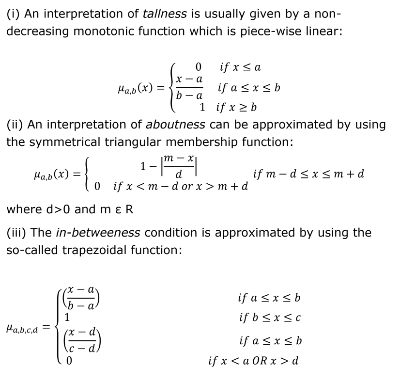

*This document contains an attempt at answering the questions from the 2014 CS4001 Fuzzy Logic exam*

# 2014

## 2014 Q1

### 1a)
**(This answer is not the same as the [model answer](https://www.scss.tcd.ie/Khurshid.Ahmad/Teaching/Lectures_on_Fuzzy_Logic/Archive_2008/2007_2008_4BA13_Model_Solutions.pdf#page=2))**  
It would be possible to describe the set of all Bertie's mammals as a crisp set, like this:  
`A = {duck-billed platypus, echidnas, horses, zebras, tigers, whales, dolphins}`  
This is a crisp set because all elements have total membership in the set of *mammals*.

However Bertie thinks that these animals are mammals to certain *degrees*. Using a crisp set like this to describe what he considers as being *mammal* loses this information. To include how Bertie feels these animals are mammals to different *extents*, the set of mammals would be better described using a *fuzzy set* like this:  
`A = {0.5/duck-billed platypus, 0.5/echidnas, 1/horses, 1/zebras, 1/tigers, 0.1/whales, 0.1/dolphins}`

### 1b)
<code>Amammals = {0.5/duck-billed platypus, 0.5/echidnas, 1/horses, 1/zebras, 1/tigers, 0.1/whales, 0.1/dolphins,0/sparrows,0/robins,0/crows,0/penguins,0/kiwis}</code>

<code>Abirds = {0/duck-billed platypus, 0/echidnas, 0/horses, 0/zebras, 0/tigers, 0/whales, 0/dolphins,1/sparrows,1/robins,1/crows,0.5/penguins,0.5/kiwis}</code>

### 1c)
<code>Emammals = {0.5/duck-billed platypus, 0.5/echidnas, 0/horses, 0/zebras, 0/tigers, 0.1/whales, 0.1/dolphins,0/sparrows,0/robins,0/crows,0/penguins,0/kiwis}</code>

### 1d)
The Law of Excluded Middle states that `A ∪ Ã = ∅`. However for Amammals:  
`A ∪ Ã = {0.5/duck-billed platypus, 0.5/echidnas, 1/horses, 1/zebras, 1/tigers, 0.9/whales, 0.9/dolphins,1/sparrows,1/robins,1/crows,1/penguins,1/kiwis}`  
Therefore Amammals also violates the Law of Excluded Middle.

The Law of Contradiction states that `A ∩ Ã = ∅`. However for Amammals:  
`A ∩ Ã = = {0.5/duck-billed platypus, 0.5/echidnas, 0/horses, 0/zebras, 0/tigers, 0.1/whales, 0.1/dolphins,0/sparrows,0/robins,0/crows,0/penguins,0/kiwis}`  
Therefore Amammals violates the Law of Contradiction.

## 2014 Q2

### 2a)

**Note to student readers: This is the same as the [model answer](https://www.dropbox.com/sh/lnfr37xev6ozm9l/AADSnjWY_82WSDjmggzTTb4Ba/CS4001-%20Fuzzy%20Logic/papers/Sample%20Answers?dl=0&preview=2014_CS4001_May+_Questions_ModelSolutionsExam.pdf), but I can't do any better than that!**

### 2b.1)

**tall:**  
<code>𝝁tall(x) = 0 if x ≤ 1.5</code>  
<code>𝝁tall(x) = (x-1.5)/(2.13-1.5) if 1.5 < x ≤ 2.13</code>  
<code>𝝁tall(x) = 1 if x > 2.13</code>

**swift:**  
<code>𝝁swift(x) = 0 if x ≤ 18</code>  
<code>𝝁swift(x) = (x-18)/(60-18) if 18 < x ≤ 60</code>  
<code>𝝁swift(x) = 1 if x > 60</code>

### 2b.2)

**Complements:**  
The complement of <code>𝝁tall(x)</code> is <code>1 - 𝝁tall(x)</code>  
The complement of <code>𝝁swift(x)</code> is <code>1 - 𝝁swift(x)</code>  

**Concentration:**  
The concentration of <code>𝝁tall(x)</code> is <code>(𝝁tall(x))n</code> where `n ≥ 1`.  
The concentration of <code>𝝁swift(x)</code> is <code>(𝝁swift(x))n</code> where `n ≥ 1`.

**Dilation:**  
The dilation of <code>𝝁tall(x)</code> is <code>(𝝁tall(x))1/n</code> where `n ≥ 1`.  
The dilation of <code>𝝁swift(x)</code> is <code>(𝝁swift(x))1/n</code> where `n ≥ 1`.

**Support:**  
The support of <code>𝝁tall(x)</code> is the crisp set of every element `x` of the `X` where <code>𝝁tall(x) > 0</code>.  
The support of <code>𝝁swift(x)</code> is the crisp set of every element `x` of the `X` where <code>𝝁swift(x) > 0</code>.  

### 2b.3)

For it to be possible for a candidate to be a Basketball player, they must be:  
Tall AND Swift.

For it to be possible for a candidate to be a Coxswain, they must be:  
NOT too Tall. (The complement of Tall)

|Candidate|Height|Speed|<code>𝝁tall(x)</code>|<code>𝝁swift(x)</code>|Basketball player possible?|Coxswain possible?|
|---------|----|---|-----|-----|-----|-----|
|Gordon   |0.97| 65|    0|    1|    0|    1|
|Brian    |1.65| 30|0.238|0.286|0.238|0.762|
|Angela   |1.75| 27|0.397|0.214|0.214|0.603|
|Nicholas |1.78| 32|0.444|0.333|0.333|0.556|
|Catherine|1.85| 31|0.556|0.31 | 0.31|0.444|
|Shaquil  |2.18| 45|    1|0.643|0.643|    0|
|Tony     |1.02| 16|    0|    0|    0|    1|

## 2014 Q3

**Note to student readers: Maybe the nature of these problems is that there is information that seems to be contradictory, but it seems to me that this question is littered with errors.**

### 3a)

Here are the membership functions for the input and output term sets:

**NEGATIVE:**  
<code>𝝁NEGATIVE(x) = 1 if x ≤ -6</code>  
<code>𝝁NEGATIVE(x) = (-3-x)/(-3-(-6)) if -6 < x < -3</code>  
<code>𝝁NEGATIVE(x) = 0 if x ≥ -3</code>

I have taken that there is a mistake in the question, seeing as MIXED is defined as "Definitely True for `-6 ≤ x ≤ 6`" but also "Definitely False for `x ≤ -6 AND x ≥ 6`". Therefore I have made a changed the classification of MIXED to be *"Definitely False for `x < -6 && x > 6`"*. (The inputs -6 and 6 will no longer be both True and False)

**MIXED:**  
<code>𝝁MIXED(x) = 0 if x > -6</code>  
<code>𝝁MIXED(x) = 1 if -6 ≤ x ≤ 6</code>  
<code>𝝁MIXED(x) = 0 if x > 6</code>

**POSITIVE:**  
<code>𝝁POSITIVE(x) = 0 if x ≤ 2</code>  
<code>𝝁POSITIVE(x) = 1-(6-x)/(6-2) if 2 < x < 6</code>  
<code>𝝁POSITIVE(x) = 1 if x ≥ 6</code>

**SMALL:**  
<code>𝝁SMALL(x) = 1 if x ≤ 1.5</code>  
<code>𝝁SMALL(x) = (2.5-x)/(2.5-1.5) if 1.5 < x < 2.5</code>  
<code>𝝁SMALL(x) = 0 if x ≥ 2.5</code>

I have taken that there is a mistake in the question, seeing as MEDIUM is defined as "Definitely True for `1.5 ≤ x ≤ 7`" but also "Definitely False for `x ≥ 7`". Therefore I have made a changed the classification of MEDIUM to be *"Definitely False for `x > 7`"*. (The input 7 will no longer be both True and False)

There is also no details about values for Y that are below 1.5. Because of this, I will presume that for the classification of MEDIUM, all values below 1.5 are "Definitely False".

**MEDIUM:**  
<code>𝝁MEDIUM(x) = 0 if x < 1.5</code>   
<code>𝝁MEDIUM(x) = 1 if 1.5 ≤ x ≤ 7</code>  
<code>𝝁MEDIUM(x) = 0 if x > 7</code>

I have taken that there is a mistake in the question, seeing as LARGE is defined as "Definitely True for `x ≥ 6`" but also "Definitely False for `x ≥ 5`". Therefore I have made a changed the classification of LARGE to be *"Definitely False for `x ≤ 5`"*. (The inputs less than or equal to 5 will be False)

**LARGE:**  
<code>𝝁LARGE(x) = 0 if x ≤ 5</code>  
<code>𝝁LARGE(x) = 1-(6-x)/(6-5) if 5 < x < 6</code>  
<code>𝝁LARGE(x) = 1 if x ≥ 6</code>

Here is the rule base governing the above mentioned SISO system:  

Rule 1: IF X is NEGATIVE THEN Y is SMALL
Rule 2: IF X is MIXED THEN Y is MEDIUM
Rule 3: IF X is POSITIVE THEN Y is LARGE

### 3bi)

For `x = 7`:

#### Fuzzification

<code>𝝁NEGATIVE(x) = 0</code>  
<code>𝝁MIXED(x) = 0</code>  
<code>𝝁POSITIVE(x) = 1</code>  

#### Inference

|Rule  |Firing Degree|
|------|-------------|
|Rule 1|            0|
|Rule 2|            0|
|Rule 3|            1|

Therefore we take it that Rule 3 is applied:  
*"IF X is POSITIVE THEN Y is LARGE"*

Because only Rule 3 fires, we know that Y is LARGE and that we should use the membership function <code>𝝁LARGE(y)</code> to calculate the output.

|y|<code>𝝁LARGE(x)</code>|
|---|---|
|0|0|
|1|0|
|2|0|
|3|0|
|4|0|
|5|0|
|6|1|
|7|1|
|8|1|
|9|1|
|10|1|

Because all of the outputs fire to the same extent, the **MOM** & **COG** are:  

`Output = ( 6*1 + 7*1 + 8*1 + 9*1 + 10*1 ) / ( 1 + 1 + 1 + 1 + 1 ) = 8`

### 3bii)

For `x = -7`:

|Rule  |Firing Degree|
|------|-------------|
|Rule 1|            1|
|Rule 2|            0|
|Rule 3|            0|

Therefore we take it that Rule 1 is applied:
*"IF X is NEGATIVE THEN Y is SMALL"*

Because only Rule 1 fires, we know that Y is SMALL and that we should use the membership function <code>𝝁LARGE(y)</code> to calculate the output.

|y|<code>𝝁SMALL(x)</code>|
|---|---|
|0|1|
|1|1|
|2|0.5|
|3|0|
|4|0|
|5|0|
|6|0|
|7|0|
|8|0|
|9|0|
|10|0|

**MOM**:  
The crisp value for the Mean of Maxima method is:

<code>( Σ alpha * x ) / ( Σ alpha )</code>

*where <code>alpha</code> is the maximum output value of the fuzzy set.*

The set is given an alpha level cut so that only values of x that give the maximum output value are used.

Using the above equation for the MOM method:  

`Output = ( 0*1 + 1*1 ) / ( 1 + 1 ) = 0.5`

**COG**:  
The crisp value for the Centre of Area method is:

<code>( Σ 𝝁LARGE(x) * x ) / 𝝁LARGE(x)</code>

*For the Centre of Area method, all values of x are used.*

`Output = ( 0*1 + 1*1 + 2*0.5 ) / ( 1 + 1 + 0.5 ) = 0.8`

## 2014 Q4

### Q4a)

I will use the linguistic variables with their term sets below:

`VOLTAGE = {SLOW_DOWN, SPEED_UP, NO_CHANGE}`

`SPEED = {TOO_SLOW,TOO_FAST,ABOUT_RIGHT}`

I will use the following symmetric triangular membership functions for each term:  

with the following values for *a*,*b* & *c* for each term:  

|Parameter|SLOW_DOWN|SPEED_UP|NO_CHANGE|TOO_SLOW|TOO_FAST|ABOUT_RIGHT|
|---------|---------|--------|---------|--------|--------|-----------|
|        a|     2.32|    2.40|     2.38|    2304|    2420|       2391|
|        b|     2.36|    2.44|     2.40|    2362|    2478|       2420|
|        c|     2.40|    2.48|     2.42|    2420|    2536|       2449|

*The a and c is the lower and upper value of each fuzzy subset, and the b is the value half way between them.*

### Q4b)

It makes sense that voltage would be applied to:  
* SLOW_DOWN the motor if it was going TOO_FAST
* SPEED_UP the motor if it was going TOO_SLOW
* Give the motor NO_CHANGE if it was going at an ABOUT_RIGHT speed

Using this knowledge and the membership functions of the term sets of the linguistic variables, I will draw fuzzy patches to represent rules for the rule base to control the behaviour of the electric motor.

The fuzzy patches are the cartesian product of the linguistic variables.

So as you can see, the rule base is:

IF SPEED is TOO_FAST THEN VOLTAGE is SLOW_DOWN
IF SPEED is TOO_SLOW THEN VOLTAGE is SPEED_UP
IF SPEED is ABOUT_RIGHT THEN VOLTAGE is NO_CHANGE
