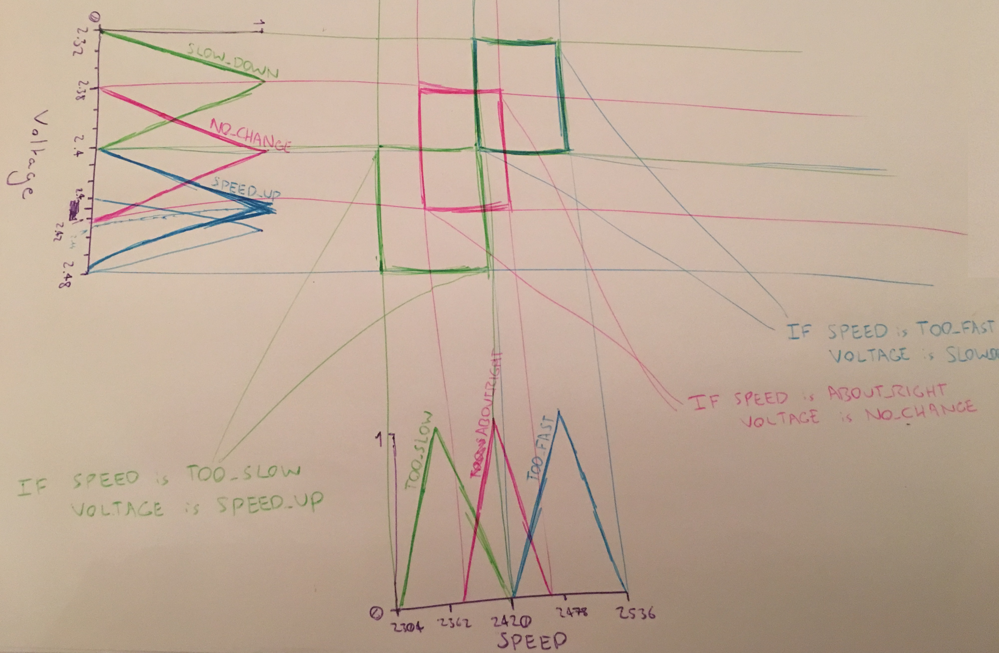

*This document contains an attempt at answering the questions from the 2015 CS4001 Fuzzy Logic exam*

# 2015

## 2015 Q1

### Q1a)

The intersection of a crisp set and its complement is the null/empty set. In most cases, the intersection of a fuzzy subset and its complement is not the null set. This is because the membership grades of Ā are 𝝁Ā(x) == 1-𝝁A(x).

### Q1b)

|Requirement|Satisfaction|
|---|---|
|Boundary|<code>T(0,0) = 0</code> & <code>T(a,1) = T(1,a) = a</code>|
|Monotonicity|<code>T(a,b) < T(c,d) if a<c & b<d</code>|
|Commutativity|<code>T(x,y) = T(y,x)</code>|
|Associativity|<code>T(x, T(y,z)) = T(T(x,z),y)</code>|

### Q1c)

The three most cited functions in the literature are:

**T-Norm**:  
Minimum: <code>Tmin = min(a,b) = a 𝚲 b;</code>  
Algebraic Product: <code>TAP = ab;</code>  
Bounded Product: <code>TBP = 0 V (a + b - 1);</code>  

**S-Norm**:  
Maximum: <code>S(a,b) = max(a,b) = a V b;</code>  
Algebraic Sum: <code>S(a,b) = a + b - ab;</code>  
Bounded Sum: <code>S(a,b) = 1 𝚲 (a + b);</code>

### Q1d)

The one main implication of using these triangular norms in fuzzy decision making is that defuzzification cannot be uniquely specified.

It can be verified that, for example by choosing different values of *a* & *b*, the following inequalities hold:  
<code>TBP ≤ TAP ≤ Tmind;</code>  
<code>Smax(a,b) ≤ SAP(a,b) ≤ SBP(a,b);</code>  
These requirements for T-norm & T-conorm functions cannot uniquely determine the classical fuzzy intersection and union (namely the min & max operators).

## 2015 Q2

### 2a)

Here are the membership functions for the input and output term sets:

**NEGATIVE:**  
<code>𝝁NEGATIVE(x) = 1 if x ≤ -6</code>  
<code>𝝁NEGATIVE(x) = (-3-x)/(-3-(-6)) if -6 < x < -3</code>  
<code>𝝁NEGATIVE(x) = 0 if x ≥ -3</code>  

**MIXED:**  
<code>𝝁MIXED(x) = 0 if x ≤ -6</code>  
<code>𝝁MIXED(x) = 1-(-3-x)/(-3-(-6)) if -6 < x < -3</code>  
<code>𝝁MIXED(x) = 1 if -3 ≤ x ≤ 3</code>  
<code>𝝁MIXED(x) = (6-x)/(6-3) if 3 < x < 6</code>  
<code>𝝁MIXED(x) = 0 if x ≥ 6</code>  

**POSITIVE:**  
<code>𝝁POSITIVE(x) = 0 if x ≤ 3</code>  
<code>𝝁POSITIVE(x) = 1-(6-x)/(6-3) if 3 < x < 6</code>  
<code>𝝁POSITIVE(x) = 1 if x ≥ 6</code>  

**SMALL:**  
<code>𝝁SMALL(x) = 1 if x ≤ 1.5</code>   
<code>𝝁SMALL(x) = (2.5-x)/(2.5-1.5) if 1.5 < x < 2.5</code>   
<code>𝝁SMALL(x) = 0 if x ≥ 2.5</code>  

I am assuming that `1≤` in the last column in the question was a mistake and was actually meant to be `≤1`.

**MEDIUM:**  
<code>𝝁MEDIUM(x) = 0 if x ≤ 1</code>  
<code>𝝁MEDIUM(x) = 1-(1.5-x)/(1.5-1) if 1 < x < 1.5</code>  
<code>𝝁MEDIUM(x) = 1 if 1.5 ≤ x < 7</code>  
<code>𝝁MEDIUM(x) = 0 if x ≥ 7</code>  

**LARGE:**  
<code>𝝁LARGE(x) = 0 if x ≤ 5</code>  
<code>𝝁LARGE(x) = 1-(7-x)/(7-5) if 5 < x < 7</code>  
<code>𝝁LARGE(x) = 1 if x ≥ 7</code>  

Here is the rule base governing the above mentioned SISO system:

Rule 1: IF X is NEGATIVE THEN Y is SMALL  
Rule 2: IF X is MIXED THEN Y is MEDIUM  
Rule 3: IF X is POSITIVE THEN Y is LARGE  

### 2b)

**Note to student reader: I'm not sure of the following, as there is no proper model answers for it.**

### 2bi)

For `x = -6`:

|Rule  |Firing Degree|
|------|-------------|
|Rule 1|            1|
|Rule 2|            0|
|Rule 3|            0|

Therefore we take it that Rule 1 is applied:
*"IF X is NEGATIVE THEN Y is SMALL"*

Because only Rule 1 fires, we know that Y is SMALL and that we should use the membership function <code>𝝁SMALL(y)</code> to calculate the output.

|y|<code>𝝁SMALL(y)</code>|
|---|---|
|0|1
|1|1
|2|.5
|3|0
|4|0
|5|0
|6|0
|7|0
|8|0
|9|0
|10|0

**MOM**:  
The crisp value for the Mean of Maxima method is:

<code>( Σ alpha * x ) / ( Σ alpha )</code>

*where <code>alpha</code> is the maximum output value of the fuzzy set.*

The set is given an alpha level cut so that only values of x that give the maximum output value are used.

Using the above equation for the MOM method:  

`( 0*1 + 1*1 ) / ( 1 + 1 ) == .5`

**COG**:  
The crisp value for the Centre of Area method is:

<code>( Σ 𝝁SMALL(x) * x ) / 𝝁SMALL(x)</code>

*For the Centre of Area method, all values of x are used.*

`( 0*1 + 1*1 + 2*0.5 + (3+4+5+6+7+8+9+10)*0 ) / ( 1 + 1 + 0.5 + 0 + 0 + 0 + 0 + 0 + 0 + 0 + 0 ) == 0.8`

### 2bii)

For `x = 6`:

|Rule  |Firing Degree|
|------|-------------|
|Rule 1|            0|
|Rule 2|            0|
|Rule 3|            1|

Therefore we take it that Rule 3 is applied:
*"IF X is POSITIVE THEN Y is LARGE"*

Because only Rule 3 fires, we know that Y is LARGE and that we should use the membership function <code>𝝁LARGE(y)</code> to calculate the output.

|y|<code>𝝁LARGE(y)</code>|
|---|---|
|0|0
|1|0
|2|0
|3|0
|4|0
|5|0
|6|0.5
|7|1
|8|1
|9|1
|10|1

**MOM**:  
The crisp value for the Mean of Maxima method is:

<code>( Σ alpha * x ) / ( Σ alpha )</code>

*where <code>alpha</code> is the maximum output value of the fuzzy set.*

The set is given an alpha level cut so that only values of x that give the maximum output value are used.

Using the above equation for the MOM method:  

`( 7*1 + 8*1 + 9*1 + 10*1 ) / ( 1 + 1 + 1 + 1 ) == 8.5`

**COG**:  
The crisp value for the Centre of Area method is:

<code>( Σ 𝝁LARGE(x) * x ) / 𝝁LARGE(x)</code>

*For the Centre of Area method, all values of x are used.*

`( 7*1 + 8*1 + 9*1 + 10*1 + 6*0.5 + (5+4+3+2+1+0)*0 ) / ( 1 + 1 + 1 + 1 + 0.5 + 0 + 0 + 0 + 0 + 0 + 0 ) == 8.222`

### 2biii)

For `x = -4`:

|Rule  |Firing Degree|
|------|-------------|
|Rule 1|        0.333|
|Rule 2|        0.667|
|Rule 3|            0|

Both Rule 1 & 2 fire:  
*IF NEGATIVE THEN Y is SMALL*  
*IF MIXED THEN Y is MEDIUM*

And therefore, SMALL & MEDIUM are used:  

|y  |<code>𝝁SMALL(y)</code>|<code>𝝁MEDIUM(y)</code>|Output of 2 rules|Weighted Output
|---|---------------------------------|----------------------------------|-----------------|---
|0|0.333|0|0.333|0
|1|0.333|0|0.333|0.333
|2|0.333|0.667|0.667|1.334
|3|0|0.667|0.667|2.001
|4|0|0.667|0.667|2.668
|5|0|0.667|0.667|3.335
|6|0|0.667|0.667|4.002

**MOM**:  
The crisp value for the Mean of Maxima method is:

<code>( Σ alpha * x ) / ( Σ alpha )</code>

*where <code>alpha</code> is the maximum output value of the fuzzy set.*

The set is given an alpha level cut so that only values of x that give the maximum output value are used.

Using the above equation for the MOM method:  

`Output = (1.334 + 2.001 + 3.335 + 2.668 + 4.002)/(0.667 + 0.667 +0.667 +0.667 +0.667 +0.667) = 3.333`

**COG**:  
The crisp value for the Centre of Area method is:

<code>( Σ 𝝁LARGE(x) * x ) / 𝝁LARGE(x)</code>

*For the Centre of Area method, all values of x are used.*

`Output = (0.333 + 1.334 + 2.001 + 3.335 + 2.668 + 4.002)/(0.333 + 0.667 + 0.667 +0.667 +0.667 +0.667 +0.667) = 3.154`

## 2015 Q3

### Q3ai)

**Mamdani**: <code>IF X is X(X) THEN Y is 𝝁(Y)</code>  
**TSK**: <code>IF X is X(X) THEN Y = f(X)</code>  

### Q3aii)

**Note to student reader: If it isn't very clear how I came up with the following answer, it's because I took it from the [model answer](https://tcd.blackboard.com/bbcswebdav/pid-960051-dt-content-rid-4009260_1/courses/CS4001-A-Y-201718/Problems%20and%20Model%20Solutions%20for%20Fuzzy%20Logic%20and%20Control.pdf#page=9) :(**

**Mamdani**: <code>X(X)</code> & <code>𝝁(Y)</code> are membership functions of the terms X & Y.  
**TSK**: <code>X(X)</code> is a membership function of term X, and Y is a linear function of X.

### Q3b)

**Note to student readers: A model answer has not been found for this paper, so I have not been able to verify this answer:**

**Takagi-Sugeno-Kang Controllers**' rules contain membership functions for the antecedants & linear functions in the consequents. The linear functions that represent the outputs have constants that need to be defined. The implication of TSK for a fuzzy logic system is that the creators of the system need to define these constants and they may be difficult to come up with.

Another implication is that TSK is not as intuitive as Mamdani systems because of its use of linear functions in the output instead of membership functions of Fuzzy Terms.

### Q3c)

#### 3ci)

<code>𝝁COLD(1) = 0.09</code>  
<code>𝝁COOL(1) = 0.08</code>  
<code>𝝁PLEASANT(1) = 0</code>  
<code>𝝁WARM(1) = 0</code>  
<code>𝝁HOT(1) = 0</code>  

Rule 1 has firing degree 0.9.   
Rule 2 has firing degree 0.08.  

SPEED = `(0*0.09 + 30*0.08)/(0.9+0.08) =  2.449)`

#### 3cii)

<code>𝝁COLD(10) = 0</code>  
<code>𝝁COOL(10) = 0.8</code>  
<code>𝝁PLEASANT(10) = 0</code>  
<code>𝝁WARM(10) = 0</code>  
<code>𝝁HOT(10) = 0</code>  

Rule 2 has firing degree 0.08.  

SPEED = `(30*0.08)/(0.8) = 30`

#### 3ciii)

<code>𝝁COLD(16) = 0</code>  
<code>𝝁COOL(16) = 0.3</code>  
<code>𝝁PLEASANT(16) = 0.4</code>  
<code>𝝁WARM(16) = 0</code>  
<code>𝝁HOT(16) = 0</code>  

Rule 2 has firing degree 0.3.  
Rule 3 has firing degree 0.4.  

SPEED = `(30*0.3 + 50*0.4)/(0.3+0.4) = 41.428`

## 2015 Q4

### Q4a)

It makes sense that voltage would be applied to:  
* SLOW_DOWN the motor if it was going TOO_FAST  
* SPEED_UP the motor if it was going TOO_SLOW  
* Give the motor NO_CHANGE if it was going at an ABOUT_RIGHT speed  

Using this knowledge and the membership functions of the term sets of the linguistic variables, I will draw fuzzy patches to represent rules for the rule base to control the behaviour of the electric motor.

The fuzzy patches are the cartesian product of the linguistic variables.

So as you can see, the rule base is:

IF SPEED is TOO_FAST THEN VOLTAGE is SLOW_DOWN  
IF SPEED is TOO_SLOW THEN VOLTAGE is SPEED_UP  
IF SPEED is ABOUT_RIGHT THEN VOLTAGE is NO_CHANGE  

### Q4bi)

To approximate the behaviour of the Mamdani controller to a zero-order TSK controller, I will de-fuzzify the outputs to single crisp values:

IF SPEED is TOO_FAST THEN VOLTAGE is 2.40  
IF SPEED is TOO_SLOW THEN VOLTAGE is 2.32  
IF SPEED is ABOUT_RIGHT THEN VOLTAGE 2.38  

*It makes sense to use the centre of each triangular membership function for the outputs of the Mamdani controller.*

### Q4bii)

**Note to student readers: I am not sure that there is a straightforward way of coming up with the functions so this will have to do for me:**

To approximate the behaviour of the Mamdani controller to a first-order TSK controller, I will de-fuzzify the outputs to linear functions of the input variable:

IF SPEED is TOO_FAST THEN VOLTAGE is v1(s)  
IF SPEED is TOO_SLOW THEN VOLTAGE is v2(s)  
IF SPEED is ABOUT_RIGHT THEN VOLTAGE v3(s)  

*Where each vi(s) is a linear function of the input variable.*

### Q4c)

TSK controllers are computationally efficient, and work well with linear techniques, optimisation techniques & adaptive techniques. TSK is well suited to mathematical analysis and also guarantees tat the output surface will be continuous. It is an approximation of the Mamdani model, and is not as intuitive to humans.

Mamdani controllers are used for capturing expert knowledge. They are intuitive, they have widespread acceptance and are well suited to human input. They are more elaborate than TSK controllers and can be a lot more computationally expensive.
