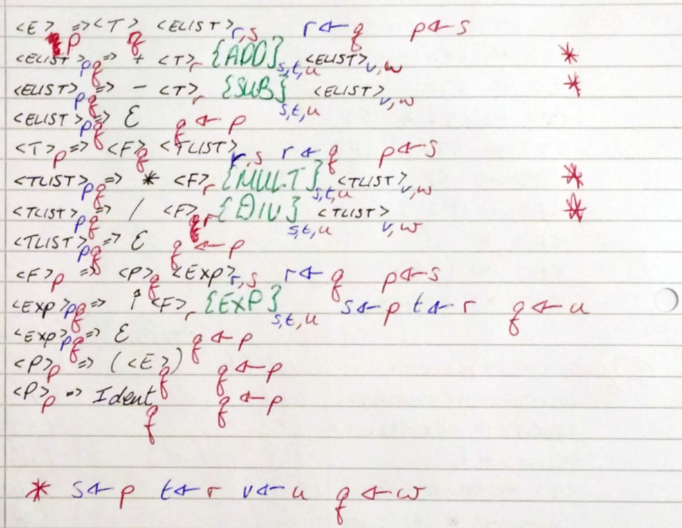
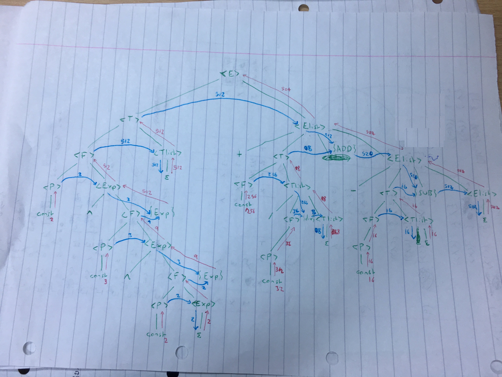
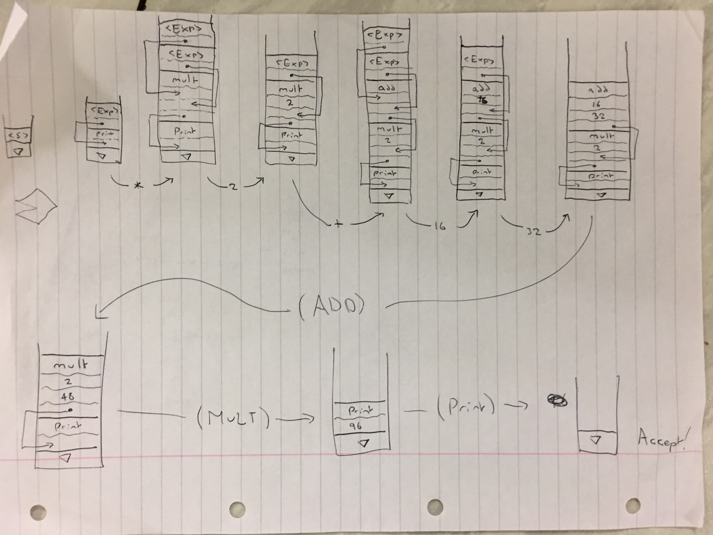

# Compilers 2015


### 1i)

```
<E> -> <E> + <T>  
<E> -> <E> - <T>  
<E> -> <T>  
<T> -> <T> * <F>  
<T> -> <T> / <F> 
<T> -> <F> 
<F> -> <P> ^ <F>  
<F> -> <P>
<P> -> (<E>)  
<P> -> const  
```

### 1ii)

```
<E> -> <T><Elist>  
<Elist> -> +<T><Elist>
<Elist> -> -<T><Elist>
<Elist> -> ϵ
<T> -> <F><Tlist>
<Tlist> -> *<F><Tlist>
<Tlist> -> /<F><Tlist>
<Tlist> -> ϵ
<F> -> <P><Exp>  
<Exp> -> ^ <F>
<Exp> -> ϵ
<P> -> (<E>)  
<P> -> const  
```

### 1iii)

Rule | First| Follow|Select|
---|---|---|---
```<E> -> <T><Elist>```|'(',const||'(','const'
```<Elist> -> +<T><Elist>```|'+'||'+'
```<Elist> -> -<T><Elist>```|'-'||'-'
```<Elist> -> ϵ```||'$',')'|'$',')'
```<T> -> <F><Tlist>```|'(',const||'(',const
```<Tlist> -> *<F><Tlist>```|'*'||'*'
```<Tlist> -> /<F><Tlist>```|'/'||'/'
```<Tlist> -> ϵ```||'+','-','$',')'|'+','-','$',')'
```<F> -> <P><Exp>```|'(',const||'(',const
```<Exp> -> ^ <F>```|'^'
```<Exp> -> ϵ```||'+','-','*','/','$',')'|'+','-','*','/','$',')'
```<P> -> (<E>)```|'('||'('
```<P> -> const```|const||const|


### 1iv)



### 1v)



### 1vi)


Where:  
 - {Add}<sub>p,q,r</sub> = r ← p + q  
 - {Sub}<sub>p,q,r</sub> = r ← p - q  
 - {Mult}<sub>p,q,r</sub> = r ← p * q  
 - {Div}<sub>p,q,r</sub> = r ← p / q  
 - {Exp}<sub>p,q,r</sub> = r ← p ^ q  

### 1vii)

**The Rules**

Rule |Action|Action number|
---|---|---|
```<E> -> <T><Elist>```|Replace(`<Elist>`,`<T>`), RETAIN|#1
```<Elist> -> +<T><Elist>```|Replace(`<Elist>`,Add,`<T>`),ADVANCE|#2
```<Elist> -> -<T><Elist>```|Replace(`<Elist>`,Sub,`<T>`),ADVANCE|#3
```<Elist> -> ϵ```|Pop(), RETAIN|#4
```<T> -> <F><Tlist>```|Replace(`<Tlist>`,`<F>`),RETAIN|#5
```<Tlist> -> *<F><Tlist>```|Replace(`<Tlist>`,Mul,`<F>`),ADVANCE|#6
```<Tlist> -> /<F><Tlist>```|Replace(`<Tlist>`,Div,`<F>`),ADVANCE|#7
```<Tlist> -> ϵ```|Pop(), RETAIN|#4
```<F> -> <P><Exp>```|Replace(`<Exp>`,`<P>`),RETAIN|#8
```<Exp> -> ^ <F>```|Replace(`<F>`),Exp,ADVANCE|#9
```<Exp> -> ϵ```|Pop(), RETAIN|#4
```<P> -> (<E>)```|Replace(`)`,`<E>`),ADVANCE|#10
```<P> -> const```|Pop(),ADVANCE|#11
```)```|Pop(),ADVANCE|#11

**The Table**

|            |+  |-  |*  |/  |^  |(  |)  |const|$  |
|------------|---|---|---|---|---|---|---|-----|---|
```<E>```    |   |   |   |   |   |#1 |   |#1   |   |
```<Elist>```|#2 |#3 |   |   |   |   |#4 |     |#4 |
```<T>```    |   |   |   |   |   |#5 |   |#5   |   |
```<Tlist>```|#4 |#4 |#6 |#7 |   |   |#4 |     |#4 |
```<F>```    |   |   |   |   |   |#8 |   |#8   |   |
```<Exp>```  |#4 |#4 |#4 |#4 |#9 |   |#4 |     |#4 |
```<P>```    |   |   |   |   |   |#10 |   |#11   |   |
```)```      |   |   |   |   |   |   |#11 |     |   |
```▽```      |   |   |   |   |   |   |   |     |Accept|

### 1vii)

(Something of this form- (but different grammar))




